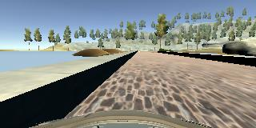
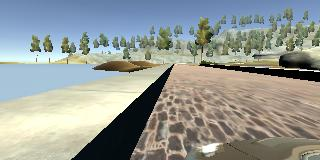
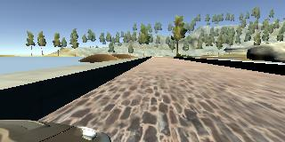
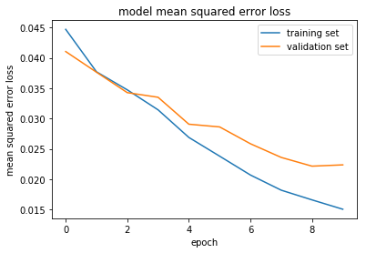

# Behavioral Cloning** 

## Writeup Template

### You can use this file as a template for your writeup if you want to submit it as a markdown file, but feel free to use some other method and submit a pdf if you prefer.

---

**Behavioral Cloning Project**

The goals / steps of this project are the following:
* Use the simulator to collect data of good driving behavior
* Build, a convolution neural network in Keras that predicts steering angles from images
* Train and validate the model with a training and validation set
* Test that the model successfully drives around track one without leaving the road
* Summarize the results with a written report


## Rubric Points
### Here I will consider the [rubric points](https://review.udacity.com/#!/rubrics/432/view) individually and describe how I addressed each point in my implementation.  

---
### Files Submitted & Code Quality

#### 1. Submission includes all required files and can be used to run the simulator in autonomous mode

My project includes the following files:
* model.py containing the script to create and train the model
* drive.py for driving the car in autonomous mode. I have not made any changes to the script supplied by Udacity.
* model.h9 containing a trained convolution neural network 
* writeup_report.md or writeup_report.pdf summarizing the results

#### 2. Submission includes functional code
Using the Udacity provided simulator and my drive.py file, the car can be driven autonomously around the track by executing 
```sh
python drive.py model.h9
```

#### 3. Submission code is usable and readable

The model.py file contains the code for training and saving the convolution neural network. The file shows the pipeline I used for training and validating the model, and it contains comments to explain how the code works.

### Model Architecture and Training Strategy

#### 1. An appropriate model architecture has been employed

My initial approach was to use LeNet, but it was hard to have the car inside the street with three epochs . After this, I decided to try the nVidia Autonomous Car Group model, and the car drove the complete first track after just three training epochs .


#### 2. Attempts to reduce over fitting in the model

At first I have not made any attempts to reduce over fitting and thought of making such attempts only when I see reason to do so. After i trained the neural network for about seven epochs, I started seeing the loss reducing on the training set but the loss on validation set started to climb up. This made me believe that the neural network now started to memorize than generalizing. This is where i felt the model may be over fitting and convinced to use dropout layer. 

I started with a dropout probability of 0.5 but that did not yield good results as the trained network may have been missing some crucial training data required to steer the vehicle at the curves. Here I have two alternatives, either augment my training data with more data or decrease the dropout probability. I chose to decrease the dropout probability as I felt that training the network on larger dataset would consume both time and resources. So, i started reducing the dropout probability and was able to obtain best results with a dropout probability of 0.2. 


#### 3. Model parameter tuning

The model used an Adam optimizer, so the learning rate was not tuned manually 

#### 4. Appropriate training data

I have supplemented the training data provided by udacity with my own training dataset.
My training data is obtained by driving two laps in counter clock direction and another lap in clockwise.
Training data also consists of recovery driving from edges of the track. Training data also consists of additional images of vehicle leaving the blacktop road and entering the brick paved over bridge. 

 

### Model Architecture and Training Strategy

#### 1. Solution Design Approach

The overall strategy for deriving model architecture was to ...
 
At the beginning I implemented the model architecture suggested by udacity (nVidia Autonomous Car Group). The five convolution layers with RELU activation followed by three fully connected layers seemed promising and performed better than any other architectures but still the car did not stay on the track .  The vehicle wavered to the sides for the first few feet and then crossed the ledge. From there on it never returned back to the track.

Later I implemented normalization using a lambda layer to bring the mean down to zero. Along with normalization, I have also cropped the input images to reduce unwanted noise from the field of view. This immediately improved the accuracy of the neural network but was not enough to keep the vehicle on track.

It is clear that I now need to augment data to better train the neural network. I have tried all the data augmentation techniques suggested by udacity in the classroom. 

  a. Included left and right images with angular correction
  b. Included flipped images of original left, center and right images with their corresponding angles multiplied by -1.
 
I have also ensured that my training data consists of multiple copies of images whenever the corresponding steering angle is beyond +- 0.5 range. This is to ensure that my neural network recognizes the steep curves and acts accordingly. 
Data augmentation techniques helped improve accuracy of network over training data. However the accuracy dropped on validation set after few epoch indicating over fitting. Then, I reduced over fitting using dropout and max-pooling layers. 

With all these improvements, the vehicle stayed on the track through out the lap , though not smooth and occasionally crossed the lane edges and recovered back on track. 

On further study and research, I realized that RELU activation might not be the right activation for a regression network. 
After some goog-ling, I tried ELU and Viola.... it did the magic.

This time the vehicle performed much better and stayed on the track for most of the lap. There were couple of instances where the vehicle just crossed the lane edges but recovered back. 


#### 2. Final Model Architecture

The final model architecture consisted of a convolution neural network with the following layers and layer sizes ...

____________________________________________________________________________________________________
Layer (type)                     Output Shape          Param       Connected to                     
____________________________________________________________________________________________________
lambda_1 (Lambda)                (None, 160, 320, 3)   0           lambda_input_1[0][0]             
____________________________________________________________________________________________________
cropping2d_1 (Cropping2D)        (None, 65, 320, 3)    0           lambda_1[0][0]                   
____________________________________________________________________________________________________
convolution2d_1 (Convolution2D)  (None, 33, 160, 24)   1824        cropping2d_1[0][0]               
____________________________________________________________________________________________________
maxpooling2d_1 (MaxPooling2D)    (None, 17, 80, 24)    0           convolution2d_1[0][0]            
____________________________________________________________________________________________________
convolution2d_2 (Convolution2D)  (None, 9, 40, 36)     21636       maxpooling2d_1[0][0]             
____________________________________________________________________________________________________
maxpooling2d_2 (MaxPooling2D)    (None, 5, 20, 36)     0           convolution2d_2[0][0]            
____________________________________________________________________________________________________
convolution2d_3 (Convolution2D)  (None, 3, 10, 48)     43248       maxpooling2d_2[0][0]             
____________________________________________________________________________________________________
maxpooling2d_3 (MaxPooling2D)    (None, 2, 5, 48)      0           convolution2d_3[0][0]            
____________________________________________________________________________________________________
convolution2d_4 (Convolution2D)  (None, 2, 5, 64)      27712       maxpooling2d_3[0][0]             
____________________________________________________________________________________________________
maxpooling2d_4 (MaxPooling2D)    (None, 1, 3, 64)      0           convolution2d_4[0][0]            
____________________________________________________________________________________________________
dropout_1 (Dropout)              (None, 1, 3, 64)      0           maxpooling2d_4[0][0]             
____________________________________________________________________________________________________
convolution2d_5 (Convolution2D)  (None, 1, 3, 64)      36928       dropout_1[0][0]                  
____________________________________________________________________________________________________
maxpooling2d_5 (MaxPooling2D)    (None, 1, 2, 64)      0           convolution2d_5[0][0]            
____________________________________________________________________________________________________
dropout_2 (Dropout)              (None, 1, 2, 64)      0           maxpooling2d_5[0][0]             
____________________________________________________________________________________________________
flatten_1 (Flatten)              (None, 128)           0           dropout_2[0][0]                  
____________________________________________________________________________________________________
dense_1 (Dense)                  (None, 128)           16512       flatten_1[0][0]                  
____________________________________________________________________________________________________
elu_1 (ELU)                      (None, 128)           0           dense_1[0][0]                    
____________________________________________________________________________________________________
dense_2 (Dense)                  (None, 50)            6450        elu_1[0][0]                      
____________________________________________________________________________________________________
elu_2 (ELU)                      (None, 50)            0           dense_2[0][0]                    
____________________________________________________________________________________________________
dense_3 (Dense)                  (None, 10)            510         elu_2[0][0]                      
____________________________________________________________________________________________________
elu_3 (ELU)                      (None, 10)            0           dense_3[0][0]                    
____________________________________________________________________________________________________
dense_4 (Dense)                  (None, 1)             11          elu_3[0][0]                      
____________________________________________________________________________________________________


#### 3. Creation of the Training Set & Training Process


To capture good driving behavior, I first recorded two laps on track using center lane driving. I then turned around and went clock wise.

I then recorded the vehicle recovering from the left side and right sides of the road back to center so that the vehicle would learn to stay on center. These images show what a recovery looks like when the vehicle is at the extreme left of the track. The images below are from the Center, Left and Right cameras during recovery in the respective order.








To augment the data sat, I also flipped images and angles thinking that this would increase the accuracy of my neural network. 

After the collection process, I had little over 50,000 images to train my network. I randomly shuffled 20% of my training set (about 10,000) into validation set.

I used this training data for training the model. The validation set helped determine if the model was over or under fitting. The ideal number of epochs was 9 as evidenced by the graph below. 



I used an Adam optimizer so that manually training the learning rate wasn't necessary.


